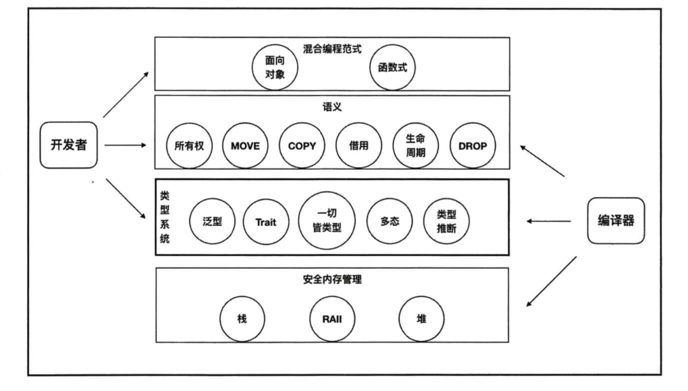

## 概述

Hi，我是jaylen，这次分享我将带你走进rust的殿堂。我会向你介绍rust能干什么，我的rust学习之路以及我用rust做了什么。通过本次分享，希望你能有如下收获：

- 熟悉如何配置一个rust实验环境
- 理清Rust当中的一些基本概念
- 了解作为一名软件工程师用Rust在实际工程当中的应用场景

## 环境准备

### 配置Rust运行环境

  - Rust环境准备

    ```shell
    curl --proto '=https' --tlsv1.2 https://sh.rustup.rs -sSf | sh
    ```

  - 安装C编译器

    ```shell
    xcode-select --install
    ```

  - 检查安装情况

    ```shell
    rustc -V
    cargo -V
    ```

### 配置VSCode编辑器支持Rust开发

- rust-analyzer插件： Rust 语言的模块化前端编译器
- crates插件：方便crate的版本选择
- CodeLLDB插件：支持Rust debug
- Better TOML插件：完整的toml特性
- Error Lens插件：行内获取编译错误提示

### 理解rustc | rustup | cargo三者关系

| 编译器       | Rustc  | Node |
| ------------ | ------ | ---- |
| 包管理器     | Cargo  | npm  |
| 包版本管理器 | Rustup | nvm  |

说明：

- 编译

  ```shell
  rustc hello.rs
  # 对应
  node hello.js
  ```

- 包管理

  ```shell
  cargo add crate名
  # 对应
  npm install lib名
  ```

- 包版本管理

  ```shell
  rustup install cargo版本 （rustup具体来说属于rust工具链管理器，只是为了前端同学方便映射已有知识体系，这里就直接这么理解就可以）
  # 对应
  nvm install npm版本
  ```

### 包下载慢怎么办？

- 由于某些神秘力量，crate（理解成rust当中的库就好，不需要理解成板条箱啥的，就是库lib）下载的很慢，我们需要想办法加速下载源。这里提供两种方法

  - 设置国内替换源(`~/.cargo/config`)

    rust关于cargo部分的配置文件跟所有类Unix系统的项目一样的，都是利用了`.XX`的名字形式放在用

    ```shell
    [source.crates-io]
    registry = "https://github.com/rust-lang/crates.io-index"
    replace-with = 'tuna'
    [source.ustc]
    registry = "git://mirrors.ustc.edu.cn/crates.io-index"
    [source.tuna]
    registry = "https://mirrors.tuna.tsinghua.edu.cn/git/crates.io-index.git"
    ```

  - 设置shell终端代理(跨墙软件需要自行购买准备)

    ```shell
    # 配置shell命令行代理别名
    ## shell-http代理
    alias open-shell-proxy='export http_proxy=http://127.0.0.1:7890'
    alias close-shell-proxy='unset http_proxy'
    ## shell-https代理
    alias open-shell-sslproxy='export https_proxy=http://127.0.0.1:7890'
    alias close-shell-sslproxy='unset https_proxy'
    ```

## 语言系统
### Rust语言层次结构

  

- 编程范式层：函数式和面向对象（开发者处理）
- 所有权系统语义层：数据所有权相关概念（开发者处理）
- 类型系统层：提供高级抽象表达能力和安全性，对底层代码执行/数据表示/内存分配的能力（开发者处理）
- 安全内存管理层：涉及内存管理相关的概念（编译器处理）

### Rust代码怎么执行的？


### 内存管理


计算中内存栈和堆的分配机制，导致了编程语言中的值分成了两个类别：值类型和引用类型。值类型指代那些数据直接存储在栈中的类型。当值类型作为右值出现在表达式中执行赋值操作时，它会创建一个副本。引用类型则将数据直接存储在堆上，而栈上放的就是如何找到他们的堆地址。

值语义和引用语义是为了解决值类型和引用类型的区分，但随着语言丰富，没办法再通过这两个类型概括归类数据值到底属于哪种类型的问题。

**值语义**：按位复制以后，新值和原始值无关 

**引用语义**：把数据存储在堆内存当中，通过栈内存放的指针来管理堆内的数据。引用语义禁止按位复制。

所谓的按位复制就是栈复制，也叫做浅拷贝。深拷贝与之相对，就是对栈上和堆上的数据一起拷贝。

引用语义禁止按位复制的原因是：浅拷贝拷贝的只是栈上的数据堆地址，如果拷贝了两份，则一份堆数据就具有了两个管理者，这样子就有了内存安全隐患。

rust引入了新的语义，复制语义和移动语义。复制语义对应着值语义，移动语义对应着引用语义。

## WebAssembly 介绍

> WebAssembly(缩写为Wasm)是一种用于基于堆栈的虚拟机的二进制指令格式。Wasm被设计为编程语言的可移植编译目标，支持在web上部署客户机和服务器应用程序。Wasm是除了 JavaScript 以外，另一种可以在浏览器中执行的编程语言。

### 云时代的wasm角色

| v8/wasmer 引擎 | unix shell        |
| -------------- | ----------------- |
| javascript     | unix 的shell 脚本 |
| webassembly    | unix 的可执行程序 |

### Wasm特点

我们可以将wasm简单理解成目标汇编语言，不过wasm 与其他的汇编语言不一样，它不依赖于具体的物理机器。可以抽象地理解成它是**概念机器的机器语言，而不是实际的物理机器的机器语言。**

### .wasm文件

```shell
00000000: 0061 736d 0100 0000 0108 0260 017f 0060  .asm.......`...`
00000010: 0000 0215 0203 656e 7603 6d65 6d02 0001  ......env.mem...
00000020: 026a 7303 6c6f 6700 0003 0201 0107 0b01  .js.log.........
00000030: 0765 7861 6d70 6c65 0001 0a23 0121 0041  .example...#.!.A
00000040: 0042 c8ca b1e3 f68d c8ab ef00 3703 0041  .B..........7..A
00000050: 0841 f2d8 918b 0236 0200 4100 1000 0b    .A.....6..A....
```

### .wat文件

```shell
;; example.wat
(module
  (import "env" "mem" (memory 1))
  (import "js" "log" (func $log (param i32)))
  (func (export "example")
    i32.const 0
    i64.const 8022916924116329800
    i64.store
    (i32.store (i32.const 8) (i32.const 560229490))
    (call $log (i32.const 0))))
```

首先从 `env.mem` 导入一个内存对象作为默认内存

然后从 `js.log` 导入一个函数，这个函数拥有一个 32 位整型的参数，不需要返回值

定义了一个函数，并导出为“example”函数
